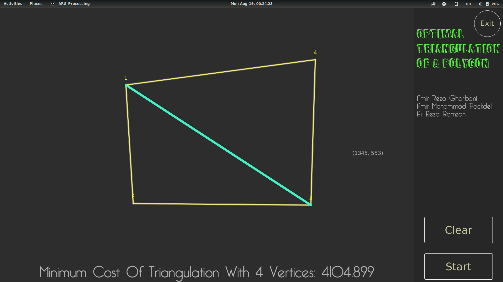

# Optimal Triangulation Problem 
Implementation of **Optimal Triangulation Problem** using **Dynamic Programming** as a course project for my *Algorithm Design* class.

* GUI is built with `processing3` library (Java version)

# Screenshot

